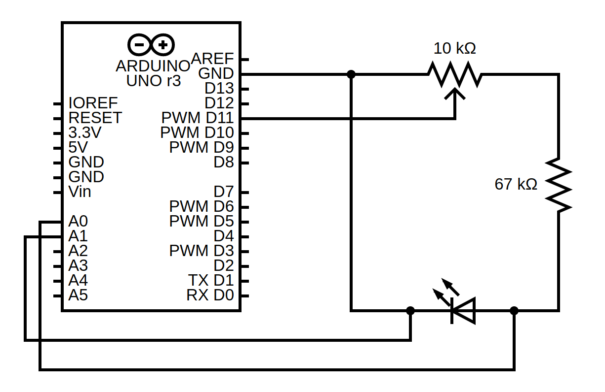
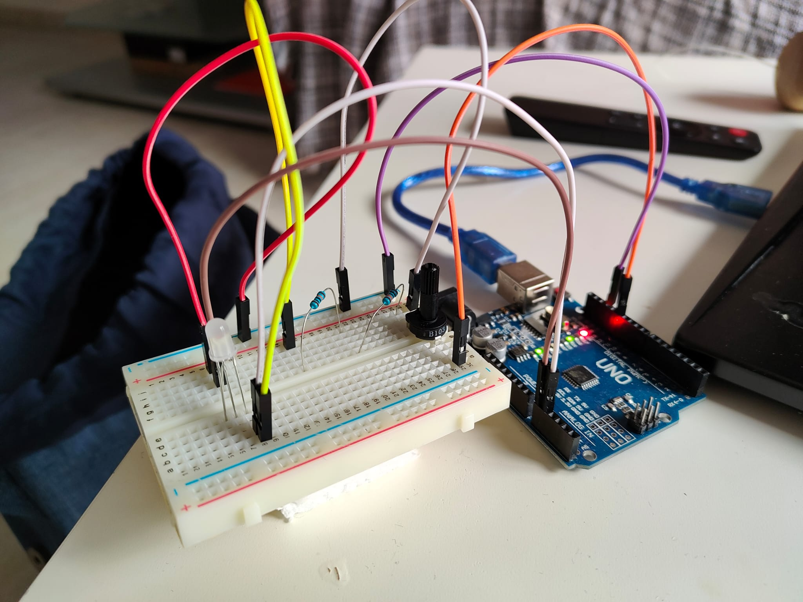
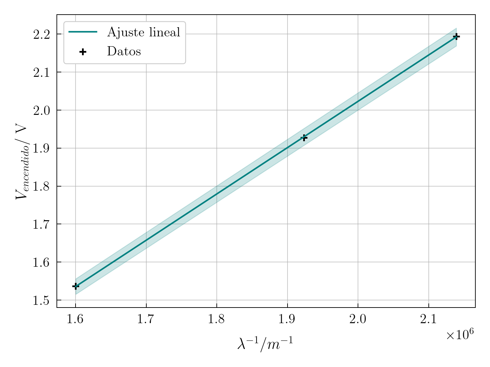

+++
title = "Cómo calcular la constante de Planck en casa."
date = "2024-07-20"
description = "Solo con una Raspberri Pi y un par de LEDs puedes calcular la constante de Planck con bastante precisión."

[taxonomies]
tags = ["physics", "project"]

[extra]
author = { name = "Pau", social= "http://twitter.com/"}
+++

Planck postuló en 1900 un resultado fundamental de la física cuántica: la energía de la radiación electromagnética está cuantizada y sigue la expresión

$$
E_{f} = h \nu
$$

dónde \\(E_f\\) es la energía del fotón, \\(h\\) es la constante de Planck y \\(\nu\\) es la frecuencia de la luz.  Sabemos además que un LED consiste de una *unión p-n*, esto es, la unión de dos materiales semiconductores: uno "p" (positivo) con *huecos* para electrones y otro "n" (negativo) con exceso de electrones. Esto causa que la corriente eléctrica solo pueda pasar en una dirección, del positivo al negativo. En reposo, los electrones no cruzan la unión p-n, puesto que necesitan una energía mínima para poder cruzarla. En otras palabras, existe una barrera de potencial. Si conectamos el diodo a un potencial eléctrico suficientemente fuerte se sobrepasará esta barrera. Denotaremos este potencial como *potencial umbral*.

Los electrones que lleguen al semiconductor positivo llenarán los huecos disponibles. No obstante, estos huecos tienen niveles de energía menores que los electrones. La energía *sobrante* de los electrones se emite en forma de radiación electromagnética (fotones) y calor. Si sobrepasamos el potencial umbral, más electrones cruzarán (más corriente), pero no cambia la energía liberada por electrón.

Vamos a asumir que el calor emitido es despreciable, de manera que la energía del fotón emitido por un electrón es íntegramente la energía eléctrica del potencial umbral:
$$
E_f = e \mathbb{V}_u,
$$
dónde \\(e\\) es la carga del electrón y \\(\mathbb{V}_u\\) es la diferencia de potencial mínima entre el cátodo y el ánodo del LED tal que se comienza a emitir luz, es decir, nuestro potencial umbral. Juntando la Ley de Plnak, la ecuación derivada y \\(\nu = c / \lambda\\), se llega a la expresión
$$
\mathbb{V}_u = \frac{hc}{e} \frac{1}{\lambda}
$$
Si medimos diferentes valores de \\(\mathbb{V}_u\\) para distintos valores de \\(\lambda\\), podemos hacer un ajuste lineal \\(V \sim 1/\lambda\\), del cual obtendremos una recta con pendiente \\(m\\), la cual será precisamente la cantidad \\(hc /\lambda\\). Reorganizando:
$$
h = m \frac{e}{c}
$$
# Desarrollo experimental

El desarrollo experimental llevado a cabo es una adaptación del descrito en el laboratorio vitual (vlab.amrita.edu) en un intento de reducir la cantidad de material de laboratorio necesario. En concreto, hemos usado un Arduino UNO, una *breadboard*, un potenciómetro (o divisor de voltaje) de  10 \\(k \Omega\\), dos resistencias equivalentes a una resistencia de 67 \\(k \Omega\\) y un LED RGB de 4 pines. El LED RGB no es más que tres diodos LED; rojo, azul y verde; que comparten cátodo. Para nuestro propósito, usaremos los diodos de diferentes colores de uno en uno. El montaje es tal y como se indica en la figura \ref{fig:montaje}.

Vamos a diseccionar que estamos haciendo usando el esquema. En primer lugar, de la salida digital \verb|D11| se sacan 4.9 V. Conectamos esto al divisor de voltaje, el cual divide nuestra corriente elećtrica en dos. Una de ellas la conectaremos a tierra (GND), completando el circuito, y otra a una resistencia conectada en serie a nuestro LED. La función de la resistencia es proteger el LED. Para terminar con la parte principal del circuito, conectamos en cátodo del LED a tierra, completando el circuito. 

De esta manera, al girar el potenciómetro elegimos la diferencia de potencial a la que sometemos al diodo, de manera que podemos parar justo cuando vemos el LED encenderse: este será nuestro potencial umbral.

Para la segunda parte del circuito, conectamos los *pines* analógicos \verb|A0| y \verb|A1| del Arduino al ánodo y cátodo del LED, respectivamente. Podemos leer los valores *analógicos* del voltaje en estos pines. En concreto, la lectura de estos voltajes devuelve un número entero: 0 para 0 V y 1023 para 4.9 V. Esto nos permite usar el mismo arduino como voltímetro, con una precisión de 4.9/1024 V. Programamos el Arduino para medir la diferencia de potencial entre el ánodo y el cátodo del LED, tal y como se puede ver en el código fuente del proyecto. 

Para tomar las medidas, conectamos únicamente uno de los colores del LED. En un ambiente oscuro, giramos el potenciómetro hasta que se comienza a emitir luz y leemos en la pantalla del ordenador la diferencia de potencial medida la placa. Los datos recogidos son los siguientes:

# Análisis de datos 

Hemos medido el voltaje de encendido de los distintos LEDs de colores y hemos obtenido las longitudes de onda, \\(\lambda\\) de las especificaciones del fabricante. Los datos exactos pueden ser encontrados en el [informe completo](plo-det2-determinacion_h.pdf). Tomaremos como nuestros datos para el ajuste la media aritmética de los valores medidos para cada color. Del ajuste lineal, que podemos ver en la figura, se obtiene una pendiente \\(m = (1.2175 \pm 0.0058) \times 10^{-6}\\) V m. Usando la expresión del ajuste y los valores bibliográficos de \\(e\\) y \\(c\\):

$$
h = (6.506 \pm 0.031) \times 10^{-34} \ J \cdot s
$$

Este valor, tiene un error de 1.79\% comparado con el valor bibliográfico, \\(h = 6.62607015\times10^{-34} \ J \cdot s\\).

# Conclusiones

En general, se pueden comentar un par de cosas desde el punto de vista de la física recreativa. En primer lugar, a pesar de no necesitar el material de laboratorio especializado que se necesita para hacer el experimento (reostato, multímetro, etc.), no todo el mundo tiene una placa de Arduino. A pesar de esto, adquirir todo lo necesario para reproducir el experimento es relativamente barato y accesible. Además, usar la placa como voltímetro no es más que una aproximación *casera* con relativamente poca precisión. 

No obstante, el resulado obtenido es satsfactorio y pone de manifiesto el comportamiento cuántico de los electrones y la radiación electromagnética.