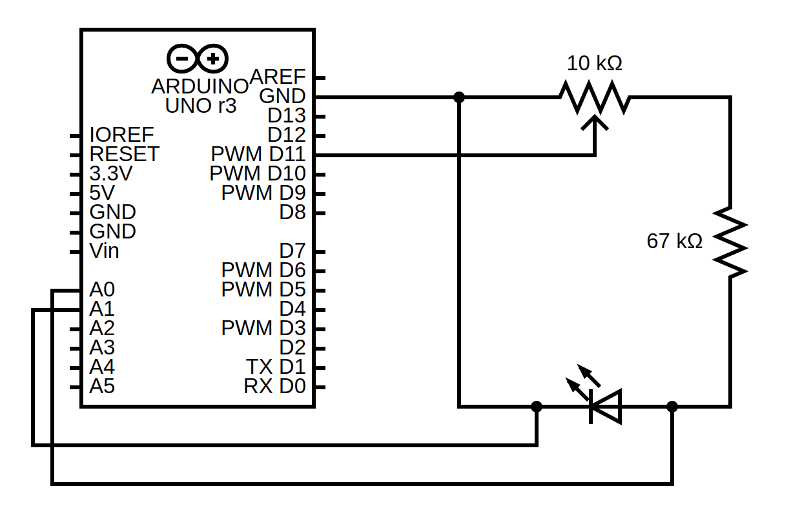
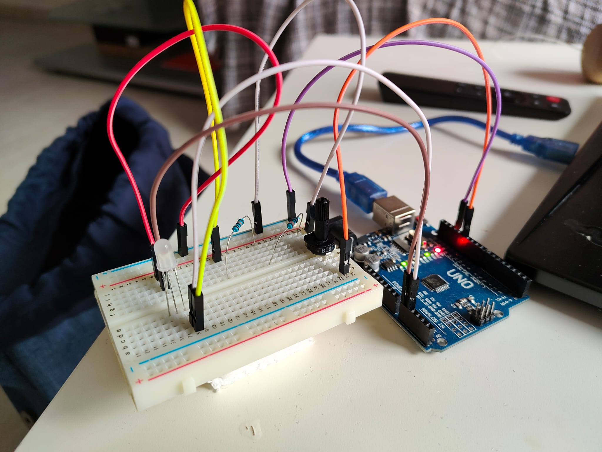
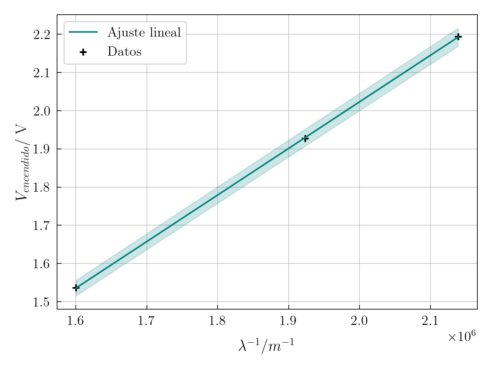

+++
title = "How to calculate Planck's constant at home"
date = "2023-02-09"
description = "With just a Raspberry Pi and a couple of LEDs you can calculate Planck's constant with decent precision."

[taxonomies]
tags = ["physics", "project"]

[extra]
author = { name = "Pau", social= "http://twitter.com/"}
+++

In 1900, Planck postulated a fundamental result of quantum physics: electromagnetic radiation energy is quantised and follows the expression

$$
E_{f} = h \nu
$$

where \\(E_f\\) is the photon energy, \\(h\\) is Planck's constant, and \\(\nu\\) is the frequency of the light. We also know that an LED consists of a *p-n junction*, i.e., the union of two semiconductor materials: a "p" (positive) one with *holes* for electrons, and an "n" (negative) one with an excess of electrons. This means electric current can only flow in one direction, from positive to negative. At rest, electrons do not cross the p-n junction because they need a minimum energy to do so. In other words, there is a potential barrier. If we connect the diode to a sufficiently strong electric potential, this barrier will be overcome. We will call this potential the *threshold voltage*.

Electrons reaching the positive semiconductor will fill the available holes. However, these holes have lower energy levels than the electrons. The *surplus* energy of the electrons is emitted as electromagnetic radiation (photons) and heat. If we go above the threshold voltage, more electrons will cross (more current), but the energy released per electron does not change.

We will assume the emitted heat is negligible, so the energy of the photon emitted by an electron is entirely the electric energy of the threshold voltage:
$$
E_f = e \mathbb{V}_u,
$$
where \\(e\\) is the electron charge and \\(\mathbb{V}_u\\) is the minimum potential difference between the LED's cathode and anode at which light begins to be emitted — our threshold voltage. Combining Planck's law, the derived equation, and \\(\nu = c / \lambda\\), we arrive at
$$
\mathbb{V}_u = \frac{hc}{e} \frac{1}{\lambda}
$$
If we measure different values of \\(\mathbb{V}_u\\) for different values of \\(\lambda\\), we can do a linear fit \\(V \sim 1/\lambda\\), from which we obtain a line with slope \\(m\\), which is precisely the quantity \\(hc / e\\). Rearranging:
$$
h = m \frac{e}{c}
$$
# Experimental setup

The experimental setup carried out is an adaptation of the one described in the virtual lab (vlab.amrita.edu) in an attempt to reduce the amount of lab equipment needed. Specifically, we used an Arduino UNO, a *breadboard*, a 10 \\(k \Omega\\) potentiometer (or voltage divider), two resistors equivalent to a 67 \\(k \Omega\\) resistor, and a 4-pin RGB LED. The RGB LED is nothing more than three LED diodes — red, blue, and green — sharing a cathode. For our purposes, we will use the different-coloured diodes one at a time. The setup is as shown in the figure.

Let us dissect what we are doing using the diagram. First, the digital output \verb|D11| supplies 4.9 V. We connect this to the voltage divider, which splits our electric current in two. One of them we connect to ground (GND), completing the circuit, and the other to a resistor connected in series to our LED. The purpose of the resistor is to protect the LED. To finish the main part of the circuit, we connect the LED's cathode to ground, completing the circuit.

In this way, by turning the potentiometer we choose the potential difference to which we subject the diode, so we can stop right when we see the LED turn on: this will be our threshold voltage.

For the second part of the circuit, we connect the Arduino's analog pins \verb|A0| and \verb|A1| to the LED's anode and cathode, respectively. We can read the *analog* voltage values on these pins. Specifically, reading these voltages returns an integer: 0 for 0 V and 1023 for 4.9 V. This allows us to use the same Arduino as a voltmeter, with a precision of 4.9/1024 V. We program the Arduino to measure the potential difference between the LED's anode and cathode, as can be seen in the project's source code.

To take measurements, we connect only one of the LED colours. In a dark environment, we turn the potentiometer until light starts to be emitted and we read the potential difference measured by the board on the computer screen. The collected data are as follows:

# Data analysis

We measured the turn-on voltage of the different coloured LEDs and obtained the wavelengths, \\(\lambda\\), from the manufacturer's specifications. The exact data can be found in the [full report](plo-det2-determinacion_h.pdf). We will take the arithmetic mean of the measured values for each colour as our data for the fit. From the linear fit, which we can see in the figure, we obtain a slope \\(m = (1.2175 \pm 0.0058) \times 10^{-6}\\) V m. Using the fit expression and the reference values of \\(e\\) and \\(c\\):

$$
h = (6.506 \pm 0.031) \times 10^{-34} \ J \cdot s
$$

This value has an error of 1.79\% compared with the reference value, \\(h = 6.62607015\times10^{-34} \ J \cdot s\\).

# Conclusions

Overall, a couple of things can be noted from a recreational physics standpoint. Firstly, despite not needing the specialised lab equipment required for the experiment (rheostat, multimeter, etc.), not everyone has an Arduino board. Nonetheless, acquiring everything needed to reproduce the experiment is relatively cheap and accessible. Furthermore, using the board as a voltmeter is merely a *homemade* approximation with fairly low precision.

Nevertheless, the result obtained is satisfactory and showcases the quantum behaviour of electrons and electromagnetic radiation.