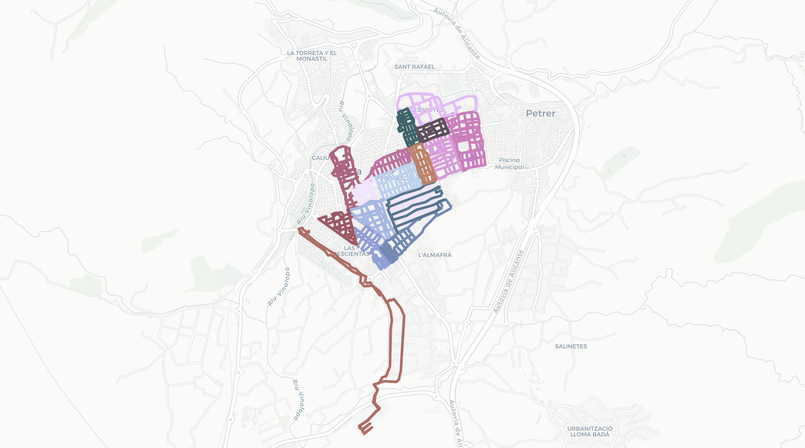

+++
title = "Recorriendo toda p&!* Elda"
date = "2024-07-08"
description = "Junto a mi querido amigo Abel, estoy recorriendo todas las calles de nuestro pueblo. ¿Por qué querría nadie recorrer todas las calles de su municipio? No lo se."

[taxonomies]
tags = ["misc", "project"]

[extra]
author = { name = "Pau", social= "http://twitter.com/"}
+++

Junto a mi querido amigo [Abel](https://abeldonate.com/), estoy recorriendo todas las calles de nuestro pueblo. ¿Por qué querría nadie recorrer todas las calles de su municipio? No lo se. Cada vez que quedamos, hablamos de nuestras vidas mientras intentamos trazar la ruta que maximice el número de calles recorridas por paso dado. Después hacemos un [**mapa**](resultingmap.html) para registrar el proceso.  

## Las reglas

Las _reglas del juego_ son sencillas. Quedamos siempre en el mismo sitio, y tiramos a andar. Se debe recorrer toda calle, avenida, vía, etc. que esté marcada como tal, esto es, que tenga nombre. Las propiedades privadas no cuentan aunque sean vías, por el momento. Además, se debe recorrer **toda la longitud** de la calle, no solamente tocarla. 

Estas reglas son más permisivas que las del [maravilloso vídeo de Tom Murphy VII](https://www.youtube.com/watch?v=1c8i5SABqwU), donde siempre parte del mismo sitio, va corriendo y más cosas. Recomiendo ver el vídeo, ¡el cual ni yo ni Abel habíamos visto antes de empezar esto! 

## Método

Cada vez que quedamos, registramos la caminata con la aplicación [Strava](https://www.strava.com/) para _trackear_ nuestra posición por GPS en todo momento. Una vez ha acabado la caminata, descargamos los datos en un ordenador y los introducimos en un script de `Python` que utiliza la librería `OpenStreetMap` para generar un archivo `html` que genera el mapa. Para más detalles, consulta el [repositorio de GitHub](https://github.com/abeldonate/walking-trackmap). 

