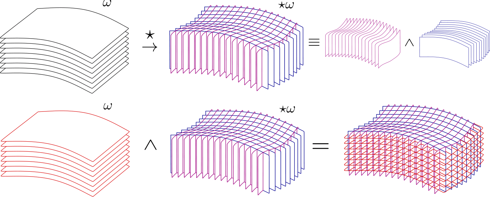

+++
title = "Trabajo de Fin de Grado"
date = "2024-07-20"
description = "Breve resumen de mi trabajo de Fin de Grado."

[taxonomies]
tags = ["physics", "project"]

[extra]
author = { name = "Pau", social= "http://twitter.com/"}
+++

El objetivo de este post es explicar la temática de mi [trabajo de fin de grado](tfg_plo_ndo.pdf). En un asola frase, trata de reformular el electromagnetismo clásico en términos puramente geométricos. 

## La motivación

La intención de este trabajo surgió de intentar reconciliar dos ideas opuestas: que el electromagnetismo es una teoría válida en el régimen de la relatividad especial y que cualquier energía curva el espacio. A lo largo del grado, solo se comenta brevemente que existe una formulación covariente de las ecuaciones de Maxwell, pero no había ningún tipo de mitivación física. 

Leyendo bibliografía, me encontré con textos más propios de física teórica. y el trabajo evolucionó a un corte mucho más matemático, donde el propósito final era hablar de electromagnetismo en espacio-tiempos curvos de la manera más natural posible: formas diferenciales en una variedad \\(\mathcal{M}\\) lorentziana de 4 dimensiones que describe nuestro espacio tiempo.

De esta manera, en analogía con el lagrangiano electromagnético clásico, se puede proponer un lagranngiano que dependa de la 1-forma campo \\(A = A^{\mu} \mathrm{d}x^{\mu}\\), la 4-forma fuente \\(J = J^{\mu} \mathrm{d}x^{\mu}\\) y la 4-forma Faraday \\(2!F = F^{\mu \nu} \mathrm{d}x^{\mu} \wedge \mathrm{d}x^{\nu}\\), el cual es
$$
\mathcal{L} = - \frac{1}{4} F_{\mu \nu} F^{\mu \nu} - J_{\mu} A^{\mu} \longrightarrow \mathcal{L} = \frac{1}{2} F \wedge \star F - A \wedge \star J.
$$
Después, aplicando el principio de mínima acción se llega a **la ecuación de Maxwell**, 
$$
\mathrm{d} \star F = \star A.
$$
Además, las otras ecuaciones de Maxwell clásicas vienen de aplicar la exactitud de la derivada exterion, \\(\mathrm{d}^2 = 0\\), de manera que 
$$
\mathrm{d} F = 0.
$$
Finalmente, en el trabajo, se demuestra que en un espacio de Minkowski, estas ecuaciones de Maxwell se reducen a las clásicas. Si tuviera que hacer el trabajo otra vez, probablemente le daría otro enfoque ligeramente diferente, pero de todas maneras, creo que merece la pena echarle un vistazo.  