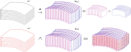

+++
title = "Bachelor's Thesis"
date = "2024-07-20"
description = "Brief summary of my Bachelor's thesis."

[taxonomies]
tags = ["physics", "project"]

[extra]
author = { name = "Pau", social= "http://twitter.com/"}
+++

The goal of this post is to explain the topic of my [Bachelor's thesis](tfg_plo_ndo.pdf). In a single sentence, it reformulates classical electromagnetism in purely geometric terms. This work, albeit bibliographical, sparked my interest in the interplay between geometry, field theories, and gravity. I also crafted some figures which — I think — deserved to be shared.

## Motivation

The intention for this work arose from trying to reconcile two opposing ideas: that electromagnetism is a valid theory in the regime of special relativity, and that any energy curves spacetime. Throughout the degree, one only briefly mentions that a covariant formulation of Maxwell's equations exists, but there was no physical motivation whatsoever.

Reading bibliography, I came across texts more typical of theoretical physics, and the work evolved into a much more mathematical cut, where the final purpose was to talk about electromagnetism in curved spacetimes in the most natural way possible: differential forms on a 4-dimensional Lorentzian manifold \\(\mathcal{M}\\) that describes our spacetime.

Before the 20th century, gravity and electromagnetism were both described by classical field theories on \\(\mathbb{R}^3\\). Maxwell's equations govern the electric and magnetic fields \\(\vec{E}\\) and \\(\vec{B}\\), while Newtonian gravity is governed by a gravitational field \\(\vec{g}\\). However, Newtonian gravity has a limited validity: it does not predict phenomena such as the perihelion precession of Mercury or gravitational lensing, which are correctly described by general relativity. Moreover, classical electromagnetism is formulated within special relativity, which is incompatible with gravity. Any electromagnetic field carries energy, and energy curves spacetime. Therefore, a consistent theory must describe both electromagnetism and gravity on the same footing.

## The geometric toolbox

To reformulate electromagnetism in a way that naturally fits into general relativity, the thesis introduces the exterior calculus on differential manifolds. The key objects are:

- A **Lorentzian manifold** \\((\mathcal{M}, g)\\), which models spacetime.
- **Differential forms**, which generalise scalar, vector and tensor fields to antisymmetric objects of any rank.
- The **exterior derivative** \\(\mathrm{d}\\), which generalises the gradient, curl and divergence.
- The **Hodge star** \\(\star\\), which maps a \\(k\\)-form to an \\((n-k)\\)-form and depends on the metric.
- The **codifferential** \\(\mathrm{d}^\dagger\\), the adjoint of \\(\mathrm{d}\\) with respect to the inner product of forms.

These tools are inherently geometric and allow one to write equations that are valid on any curved spacetime, not just flat Minkowski space.

## The electromagnetic Lagrangian as a differential form

In analogy with the classical electromagnetic Lagrangian, one can propose a Lagrangian that depends on the field 1-form \\(A = A\_{\mu} \mathrm{d}x^{\mu}\\), the source 1-form \\(J = J\_{\mu} \mathrm{d}x^{\mu}\\), and the Faraday 2-form \\(F = \mathrm{d}A\\). In tensor notation the classical Lagrangian is
$$
\mathcal{L}\_{EM} = - \frac{1}{4} F\_{\mu \nu} F^{\mu \nu} - J^{\mu} A\_{\mu}.
$$
Using the Hodge star, this can be rewritten as a 4-form Lagrangian that naturally couples to the geometry:
$$
\mathcal{L}\_{EM-G} = -\frac{1}{2} F \wedge \star F - A \wedge \star J.
$$
Remarkably, this expression depends on the metric \\(g\_{\mu \nu}\\) only through the Hodge star operator \\(\star\\), so the coupling between electromagnetism and gravity is encoded geometrically.

## Deriving Maxwell's equations

Applying Hamilton's principle to the action, i.e.,
$$
S = \int\_{\mathcal{M}} \mathcal{L}\_{EM-G}
$$
means considering a perturbation \\(A' = A + \delta A\\) of the potential 1-form, with \\(\delta A = 0\\) on the boundary \\(\partial \mathcal{M}\\). The perturbed Faraday 2-form is \\(F' = F + \delta F\\), where \\(\delta F = \mathrm{d} \delta A\\):

Demanding that the variation \\(\delta S\\) vanish for arbitrary perturbations yields the **inhomogeneous Maxwell equation**,
$$
\mathrm{d} \star F = \star J.
$$
The **homogeneous Maxwell equation** follows directly from the definition of \\(F\\) and the nilpotency of the exterior derivative, \\(\mathrm{d}^2 = 0\\), yielding
$$
\mathrm{d} F = 0.
$$
In the language of forms, the homogeneous equation has no physical content of its own — it is a consequence of having formulated the theory in terms of a 4-potential \\(A\\). The inhomogeneous equation, however, depends on the metric via \\(\star\\), so it tells us how the geometry affects electromagnetism.

To visualise what these equations mean geometrically, consider a point charge \\(q\\) at the origin in flat spacetime. The potential 1-form is \\(A = q r^{-1} \mathrm{d}t\\), so the Faraday 2-form and its Hodge dual are
$$
F = \frac{q}{r^{2}} \mathrm{d} t \wedge \mathrm{d} r, \qquad \star F = q \sin(\theta)   \mathrm{d} \theta \wedge \mathrm{d} \phi.
$$
The Faraday tubes have no end (homogeneous equation), while the dual tubes end where the charge sits (inhomogeneous equation):

## Coupling to gravity: Einstein-Maxwell

To complete the picture, one considers the combined electrogravitational Lagrangian
$$
\mathcal{L}\_{EG} = \frac{1}{2\kappa} R   \mathrm{dv}\_4 - \frac{1}{2} F \wedge \star F - A \wedge \star J,
$$
where \\(R\\) is the Ricci scalar and \\(\mathrm{dv}\_4\\) is the volume form. Varying this action with respect to the metric \\(g^{\mu \nu}\\) leads to the Einstein field equations with an electromagnetic energy-momentum tensor:
$$
R\_{\mu \nu} - \frac{1}{2} R g\_{\mu \nu} = \kappa T\_{\mu \nu}.
$$
The tensor \\(T\_{\mu \nu}\\) is derived from the electromagnetic Lagrangian and encodes how the electromagnetic field acts as a source for gravity. 

## The classical limit

A crucial check is that the new formulation reduces to the familiar Maxwell equations in flat spacetime. Taking the metric to be Minkowski, \\(\eta\_{\mu \nu} = \mathrm{diag}(-1, 1, 1, 1)\\), and writing the potential 1-form as \\(A = -\phi   \mathrm{d}t + A\_x   \mathrm{d}x + A\_y   \mathrm{d}y + A\_z   \mathrm{d}z\\), the Faraday 2-form becomes
$$
F = -E\_x   \mathrm{d}t \wedge \mathrm{d}x - E\_y   \mathrm{d}t \wedge \mathrm{d}y - E\_z   \mathrm{d}t \wedge \mathrm{d}z + B\_z   \mathrm{d}x \wedge \mathrm{d}y - B\_y   \mathrm{d}x \wedge \mathrm{d}z + B\_x   \mathrm{d}y \wedge \mathrm{d}z.
$$
Applying \\(\mathrm{d}F = 0\\) and \\(\mathrm{d}\star F = \star J\\) then reproduces the four classical Maxwell equations in vector notation. This confirms that the geometric formulation is a genuine generalisation, not a replacement, of the standard theory. This also serves as a consistency check, since the minkowski metric will only happen when all fields are identically zero!

## Conclusions

The formalism described does not capture the full physical reality, because it ignores the quantum nature of electromagnetic radiation. Nevertheless, it provides a consistent joint description of classical electromagnetism and gravity. A particularly simple solution to the Einstein-Maxwell equations is the Reissner-Nordström metric, which describes a charged, non-rotating body. More complex solutions such as Kerr-Newman describe charged rotating black holes.

Beyond its immediate physical application, the differential-form description of electromagnetism is a natural stepping stone to more advanced field theories that are usually expressed in the same geometric language. In the words of Misner, Thorne and Wheeler, *differential forms illuminate electromagnetism, and electromagnetism illuminates differential forms*.
